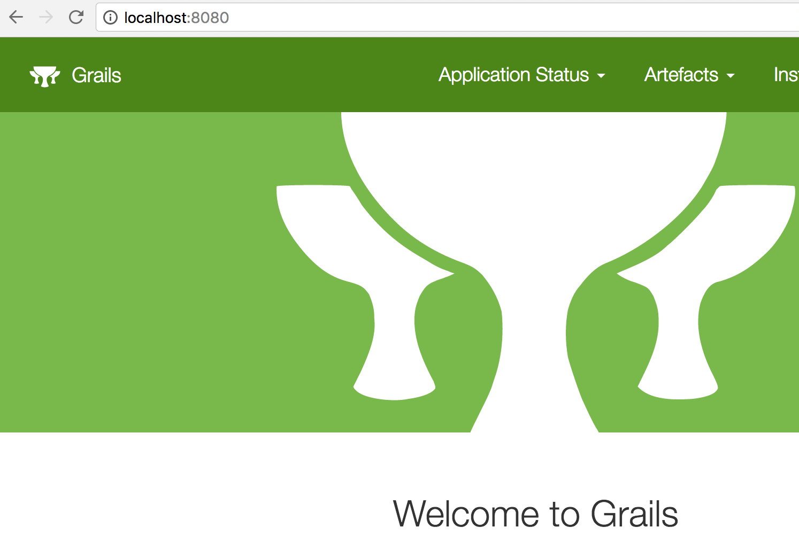

# Grailsアプリケーションをtravis CI、Herokuと連携する
## 概要
- タイトルの通りの事をやろうとしたら、結構戸惑ったためメモ。
  - Grails、Gradle、travis CI、Heroku全てが全くわかっていなかったという事を実感。。。
- 特に難しいことはしていませんが、誤っている点、もっと簡単な方法等がありましたらコメント、ブコメ、Twitterなどで教えてください。 // TODO リンク貼る

## アジェンダ
1. Grailsのデフォルトアプリを作成
2. Herokuで動作させる
3. GitHubにpush
4. Travis CIと連携

## 環境
- Grails Version: 3.2.8
- Groovy Version: 2.4.10
- JVM Version: 1.8.0_121

## 前準備
- Javaのインストール
  - Windowsの場合
    - ここからインストーラを取得して実行
  - Macの場合
    - SDKMANでインストール
      - ```sdk install java```
    - HomeVrewでインストール
      - ```vrew install java```
- Grailsのインストール
  - Windowsの場合
    - ここからバイナリを取得して解凍
    - 必要があればPATHにbinを追加
  - Macの場合
    - SDKMANでインストール
      - ```sdk install grails```
- Herokuアカウント作成
  - https://www.heroku.com/
- Heroku CLI（Heroku Command Line Interface）のインストール
  - 元々はToolbeltという名称。（[参考](https://devcenter.heroku.com/articles/heroku-cli)）
  - Windowsの場合
    - [ここから](https://devcenter.heroku.com/articles/heroku-cli)インストーラ取得して実行。
  - Macの場合
    - ```brew install heroku```
- travis CIアカウント作成
  - https://travis-ci.org/
- travisのインストール
  - rubyが必要。
  - ```gem install travis```
- Gitのインストール
  - 手順は割愛
- GitHubの登録
  - 手順は割愛

## Grailsのデフォルトアプリを作成
1. grailsコマンドでアプリケーションを作成。
```sh
grails create-app grails-heroku-example2
```
2. アプリケーションを起動
```sh
cd grails-heroku-example2
./grailsw run-app
```
3. [http://localhost:8080](http://localhost:8080)にアクセス
- 以下のような画面が表示されればOK


## Herokuで動作させる
1. ```build.gradle``` にstageタスクを追記
  - [GradleでSpringBoot、Ratpack以外を使用する場合はstageタスクを実行するらしい](https://devcenter.heroku.com/articles/deploying-gradle-apps-on-heroku#verify-that-your-build-file-is-set-up-correctly)
```
task stage {
  dependsOn build
}
```
2. Procfileをカレントに作成。
  - herokuでアプリケーションを実行するコマンドを記載する。
  - 今回の場合、作成するwarを起動する。
```
web: java -Dserver.port=$PORT $JAVA_OPTS -jar build/libs/grails-heroku-example2-0.1.war
```
3. Gitで管理する
```sh
git init
git add .
git commit -m "first commit"
```
4. Heroku　CLIでログイン
  - ```heroku login```
  - メールアドレスとパスワード入力。
5. Heroku上にアプリケーションを作成
  - ```heroku create grails-heroku-example2```
  - アプリ名は省略も可能。
  - アプリ名はHeroku全体でユニークである必要があるので注意。
6. リモートリポジトリが追加されていることを確認。
  - ```git remote -v```
```
heroku	https://git.heroku.com/grails-heroku-example2.git (fetch)
heroku	https://git.heroku.com/grails-heroku-example2.git (push)
```
7. Herokuへデプロイ
  - ```git push heroku master```
  - ```BUILD SUCCESSFUL```的なメッセージが表示されればOK
8. 確認
  - ```heroku open```
  - ローカルで実行時と同じ画面が出ればOK

## GitHubにpush
1. GitHubにリポジトリを作成
2. GitHubにpush
```sh
git remote add origin git@github.com:yamap55/grails-heroku-example2.git
git push -u origin master
```

## Travis CIと連携
- [Travis CI](https://travis-ci.org/)にログイン
- ↑でGitHubに作ったリポジトリをEnableにする。
  - 2017/04/04現在だと、Mｙ Repositoriesの横の+か、右上の自分のアイコンをクリックすることで自分のリポジトリの一覧が表示される。
  - リポジトリが表示されない場合には右上の「Sync account」を押下することで再同期されます。
- 空の連携設定ファイルをカレントに作成
```
touch .travis.yml
```
- ```.travis.yml``` を設定
  - ```travis setup heroku```
- ```.travis.yml``` に設定を追加
  - ```language: groovy```
  - ファイルの先頭に追加。
  
