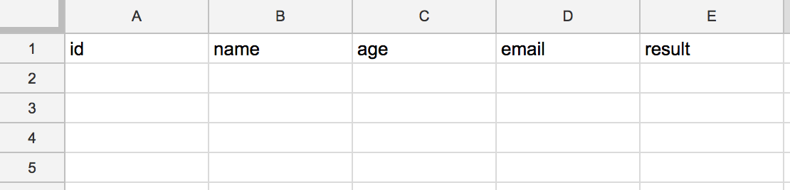
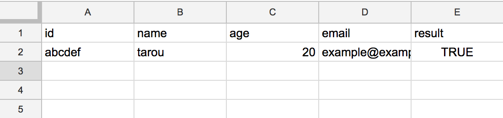

## JSONをPOSTしてGoogle SpreadSheetに書き込む
### はじめに
- GASでPOSTを受け付けて、SpreadSheetに書き込む手順です。
- GroovyからSpreadSheetに書き込みたかったが、GData APIを使用するためのライブラリである、[gdata-java-client](https://mvnrepository.com/artifact/com.google.gdata/core)をGrapeで入れようとしたら、うまく入らなかったのでやめたという経緯があったりします。

### 仕様
- スプレッドシート


- JSON
```json
{
  "id":"abcdef",
  "user":{
    "name":"tarou",
    "age":20,
    "email":"example@example.com",
    "result":true
  }
}
```

### 手順
- スプレッドシートを作成
  - 適当にヘッダとか作っときます。
- ツール → スクリプトエディタ
- GASのコードを書く。
  - doPostはPOST、doGetはGETの時に呼ばれます。
  - 今回はPOSTで作成。

```javascript
function doPost(e) {
  var jsonString = e.postData.getDataAsString();
  var data = JSON.parse(jsonString);

  var id = data.id;
  var name = data.user.name;
  var age = data.user.age;
  var email = data.user.email;
  var result = data.user.result;

  // シート取得
  var ss = SpreadsheetApp.openById(SpreadsheetApp.getActiveSpreadsheet().getId());
  var sheet = ss.getSheetByName("シート1");

  // データ入力
  sheet.appendRow([id, name, age, email, result]);
}
```

- 保存
- 公開 → ウェブアプリケーションとして公開
- プロジェクトバージョン
  - 新規作成
  - コミットコメント
- 次のユーザとしてアプリケーションを実行
  - 自分
- アプリケーションにアクセスできるユーザー
  - 全員（匿名ユーザーを含む）
- 「承認が必要です」というダイアログが表示される。
  - 許可を確認 → 許可
- 「現在のウェブアプリケーションのURL」をメモ。
- POST
  - ```curl -v -H "Accept: application/json" -H "Content-type: application/json" -X POST -d '{"id":"abcdef","user":{"name":"tarou","age":20,"email":"example@example.com","result":true}}' https://script.google.com/macros/s/xxxxxxxxx/exec```
- 確認


### 参考
- [https://gist.github.com/cho45/4222750](https://gist.github.com/cho45/4222750)
- [https://gist.github.com/roundrop/5926836](https://gist.github.com/roundrop/5926836)
