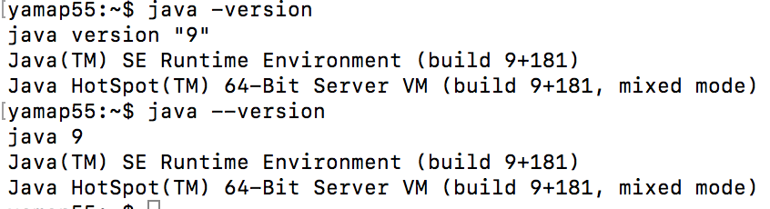

# Java9について
エンジニア勉強会 （2017/10/24）

---

## 祝 Java SE 9 リリース
2017/09/21にJava SE 9がリリースされました。
Java SE 8が2014/03/18なので3年半ぶり。
Java SE 7が2011/07/28
Java SE 6が2006/12/11

---

## 過去のリリース日

| version |    date    |
|:-------:|:----------:|
|    5    | 2004/09/30 |
|    6    | 2006/12/11 |
|    7    | 2011/07/28 |
|    8    | 2014/03/18 |
|    9    | 2017/09/21 |

---

## 参考
- [新しいリリースモデルはJavaを使う人 全員要注目だった](http://d.hatena.ne.jp/nowokay/20171007#1507284356)
- [Oracle Java SEサポート・ロードマップ](http://www.oracle.com/technetwork/jp/java/eol-135779-ja.html)
- [Faster and Easier Use and Redistribution of Java SE](https://orablogs-jp.blogspot.jp/2017/09/faster-and-easier-use-and.html)

---

## リリースモデル
- 6ヶ月毎に機能リリース
- 3ヶ月毎にメンテナンス/セキュリティリリース
- サポート期間は次の機能リリースまで
- 3年毎に長期サポート付きのLTSリリース

---

## リリースモデル
- LTSリリースはOracle JDKのみ
- Oracle JDKは商用及びサポート顧客向け

---

##

---

## REPL導入
- JShell
- 「Hello World」が簡単に。

---

##

---

## 余談
```java --version``` でもバージョンが表示されるようになりました。

---

## ちょっと違う



---

## ご清聴ありがとうございました。🙇
