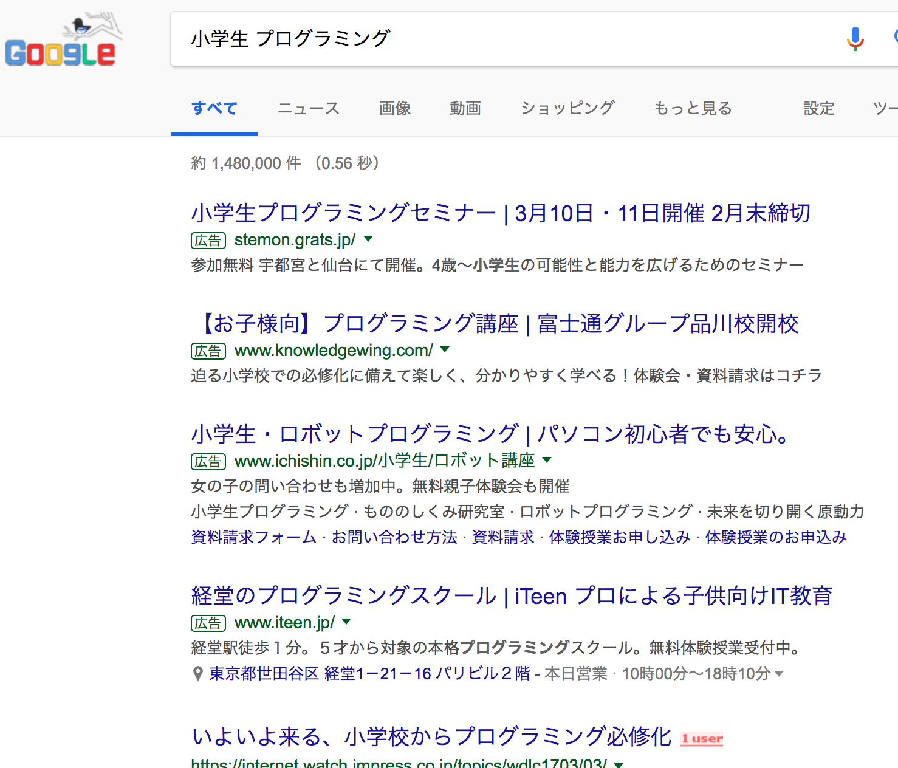

# 小学生のプログラミング教育必修化とScratch
エンジニア勉強会 （2018/02/20）

---

## アジェンダ
- はじめに
- 「プログラミング的思考」って何？

---

## アジェンダ
- **☆はじめに**
- 「プログラミング的思考」って何？

---

## 小学生のプログラミングが話題



---

## こんなキーワードと共によく聞く
- [Minecraft Education Edition](https://education.minecraft.net/)
- [Code.org](https://studio.code.org/)
- [Scratch](https://scratch.mit.edu/)
- [プログラミングゼミ](https://programmingzemi.com/)

---

## 2020年度から小学校でプログラミング教育が必修化されます

---

## 「プログラミング」という教科が作られる訳ではない

---

## 既存の国語、算数、理科、社会などの教科の中に組み込まれます

---

```
・身近な生活でコンピュータが活用されていることや、問題の解決には必要な手順があることに気付くこと
・各教科等で育まれる思考力を基盤としながら基礎的な「プログラミング的思考」を身に付けること
・コンピュータの働きを自分の生活に生かそうとする態度を身に付けること
```

---

## アジェンダ
- はじめに
- **☆「プログラミング的思考」って何？**

---

## 「プログラミング的思考」って何？🤔

---

## 小学校学習指導要領
- 第3の1の(3)


---

## 小学校学習指導要領
- 第2の2の(1)


---


## 参考URL
- [学習指導要領等、小学校学習指導要領](http://www.mext.go.jp/a_menu/shotou/new-cs/1384661.htm)
- [小学校段階におけるプログラミング教育の在り方について（議論の取りまとめ）](http://www.mext.go.jp/b_menu/shingi/chousa/shotou/122/attach/1372525.htm)

---

---

## ご清聴ありがとうございました。🙇
